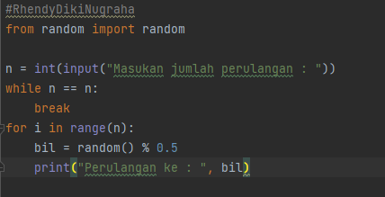
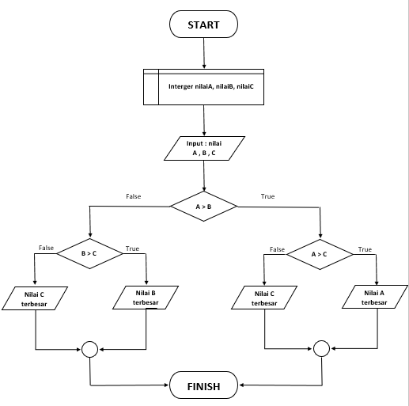

# Praktikum 6
| No | DAFTAR ISI  | LINKS |
|-------------| ------------- | ------------- |
| 1 | Lab2 : Struktur Kondisi  | [Menuju Kesini](https://github.com/RhendyDikiN/Praktikum6#lab-2--struktur-kondisi)  |
| 2 | Lab3 : Perulangan  | [Menuju Kesini](https://github.com/RhendyDikiN/Praktikum6#lab-3--perulangan) |
| 3 | Labspy02  | [Menuju Kesini](https://github.com/RhendyDikiN/Praktikum6#labspy02) |
| 4 | Labspy03  | [Menuju Kesini](https://github.com/RhendyDikiN/Praktikum6#labspy03) |

## KONDISIONAL DAN PERULANGAN
### Lab 2 : Struktur Kondisi
#### Latihan 1
Pada Latihan 1. Disini kita membuat sebuah program sederhana dengan input 2 buah bilangan, kemudian menentukan bilangan terbesar dari kedua bilangan tersebut dengan menggunakan statement if. 
 Langkah pembuatan program 
• Pastikan sudah mendownload python, lalu buka software PyCharm. Begini urutan program dari Latihan 1 ini : 
 
• Jika sudah, maka hasil RUN akan seperti ini : 
 
#### Latihan 2
Latihan 2, kita akan mengurutkan data dari yang terkecil ke terbesar, berdasarkan input yang kita masukkan. 
 Langkah pembuatan program 
• Berikut adalah isi program untuk menjalankan perintah diatas : 
 
• Maka hasil RUN nya akan seperti ini : 
 
### Lab 3 : Perulangan
#### Latihan 1
Pada Latihan 1. Perintahnya adalah membuat program perulangan bertingkat ( nested ) for, yang menghasilkan output sebagai berikut : 
 
 Langkah pembuatan program 
• Untuk menghasilkan output seperti diatas, maka membutuhkan program seperti ini : 
 
• Dengan hasil RUN sebagai berikut : 
 
#### Latihan 2
Untuk latihan 2, programnya adalah menampilkan bilangan acak yang lebih kecil dari 0.5, dengan bilangan sesuai yang kita inputkan.
 Langkah pembuatan program 
• Program untuk menjalankan perintah tersebut adalah : 
 
• Dengan hasil RUN sebagai berikut : 
  
Itulah isi dari kondisional dan perulangan, jika ada kesalahan mohon maaf, dan terimakasih sudah membaca.

## MODUL PRAKTIKUM 2 DAN 3
### PRAKTIKUM 2
#### Labspy02
Tugas pada praktikum 2 ini, yaitu membuat program sederhana dengan input tiga buah bilangan. Lalu menentukan bilangan terbesar dari ketiga bilangan tersebut. 
• Sebelum masuk kepada programnya, saya akan menampilkan terlebih dahulu Flowchartnya. Berikut ini adalah flowchartnya : 
 
• Jika dimasukkan kedalam program maka akan jadi seperti ini : 
 
• Dan hasil RUN nya akan seperti ini : 
 
#### Labspy03